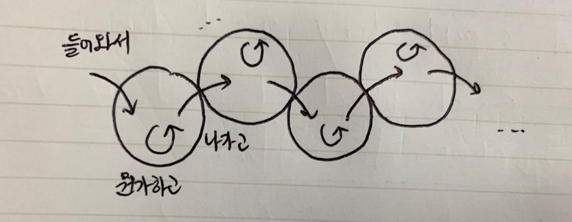

# Understanding Space, Event, and Business Strategy

## Table of Contents
- Overview
  - Relationship Between Space and Event
  - Touchpoint and Converrsion (Event Classification From the Business Perspective)
- Structure
- Implementation
- What's Next?

## Overview

### Relationship Between Space and Event

사람들은 공간에 들어와서, 무언가 하고, 나갑니다. 모든 사람들의 모든 순간은 공간에 들어가고 있거나, 공간에서 무엇을 하고 있거나, 공간에서 나가고 있습니다. 공간은 음식점이나, 쇼핑몰 등 물리적인 공간일 수도 있지만, 인터넷 공간이나 모바일 앱과 같은 디지털 공간일 수도 있습니다.

예를 들어봅시다.

지하철에서 유미의 세포들 네이버 웹툰을 봅니다. 웹툰앱을 닫으려는데 이니스프리에서 유미의 세포들 부채를 준다는 광고를 봅니다. 강남역 11번 출구로 나와 걷습니다. 네이버 지도앱을 켜서 무인양품을 검색합니다. 검색하다가 이니스프리가 근처에서 있다는 것을 발견합니다. 무인양품에 들어갑니다. 1층에서 옷을 구경하고, 지하 1층에서 노트와 펜을 장바구니에 담습니다. 1층으로 올라와 결제 줄에서서 무인양품 패스포트 앱을 실행합니다. 얼마 전  '무인양품 디자인'에서 본 발뮤다x무인양품 공기청정기를 봅니다. 적립을 하고 나가는 길에 공기청정기를 한 번 살펴보고 나갑니다. 스타벅스에 들어가 자리에 앉습니다. 스타벅스 앱을 켰는데, 프라푸치노 추천메뉴가 뜹니다. 프라푸치노를 장바구니에 담았다가 취소하고 아메리카노를 사이렌오더로 주문합니다. 커피를 마시고 나갑니다. 가는 길에 YES24 중고서점에 들렀다가 옵니다. 이니스프리로 이동하여 화장품을 결제하고 부채를 받습니다. 집으로 돌아오는 길 부채를 찍어 SNS에 올립니다.

위 이야기를 아래 처럼 Event 단위로 옮겨적을 수 있습니다.

| Space                  | Event                                              | Time     |
|------------------------|----------------------------------------------------|----------|
| 네이버 웹툰 (앱)       | 유미의 세포들 보기 (Do)                            | 13:45:00 |
| 네이버 웹툰 (앱)       | 유미의 세포들 다 본 다음 이니스프리 광고 노출 (Do) | 13:47:54 |
| 강남역 11번 출구       | 나옴 (Out)                                         | 14:00:02 |
| 네이버 지도 (앱)       | 켬 (In)                                            | 14:00:02 |
| 네이버 지도 (앱)       | 무인양품 검색 (Do)                                 | 14:00:03 |
| 네이버 지도 (앱)       | 이니스프리 발견 (Do)                               | 14:00:07 |
| 네이버 지도 (앱)       | 닫음 (Out)                                         | 14:00:10 |
| 무인양품               | 들어감 (In)                                        | 14:03:04 |
| 무인양품               | 옷구경 (Do)                                        | 14:03:10 |
| 무인양품               | 지하1층 내려감 (Do)                                | 14:13:03 |
| 무인양품               | 노트 구경 (Do)                                     | 14:19:00 |
| 무인양품 패스포트 (앱) | 켬 (In)                                            | 14:23:30 |
| 무인양품 패스포트 (앱) | 공기청정기 마케팅 노출 (Do)                        | 14:23:33 |
| 무인양품 패스포트 (앱) | 바코드 메뉴 찍음 (Do)                              | 14:23:40 |
| 무인양품               | 결제 (Do)                                          | 14:23:45 |
| 무인양품               | 나감 (Out)                                         | 14:30:00 |
| 스타벅스               | 들어감 (In)                                        | 14:33:55 |
| 스타벅스 (앱)          | 켬 (Do)                                            | 14:35:05 |
| 스타벅스 (앱)          | 프라푸치노 추천메뉴 노출 (Do)                      | 14:35:15 |
| 스타벅스 (앱)          | 추천메뉴 장바구니 (Do)                             | 14:35:40 |
| 스타벅스 (앱)          | 취소하고 아메리카노 결제 (Do)                      | 14:40:50 |
| 스타벅스               | 커피마심 (Do)                                      | 14:50:00 |
| 스타벅스               | 나감 (Out)                                         | 15:33:40 |
| YES 24                 | 들어감 (In)                                        | 15:35:40 |
| YES 24                 | 나감 (Out)                                         | 15:39:40 |
| 이니스프리             | 들어옴 (In)                                        | 15:50:00 |
| 이니스프리             | 결제하고 부채받음 (Do)                             | 15:53:00 |
| 이니스프리             | 나감 (Out)                                         | 15:54:00 |
| 인스타그램             | 켬 (In)                                            | 19:03:40 |
| 인스타그램             | 부채 올림 (Do)                                     | 19:22:33 |

들어가는 것을 In, 나가는 것을 Out, 뭔가 하는 것을 Do로 라벨링했습니다. In, Out, Do 이벤트는 어떻게 활용할 수 있을까요?

- In: 관심있음
- Out: In부터 Out까지 걸린 시간 (어느 정도 관심있는지 유추할 수 있음)
- Do: 구체적인 관심사에 대해 알 수 있음

이벤트를 유심히 살펴봤다면 조금은 이상한 분류를 발견했을지도 모릅니다. `공기청정기 마케팅 노출 (Do)`와 `프라푸치노 추천메뉴 노출 (Do)`는 무엇을 했다고 표현하는 것보다 당했다고 표현하는 것이 더 합리적으로 보입니다. 우리는 이 Do라는 행동을 Touchpoint와 Conversion란 개념으로 나눌 수 있습니다.

### Touchpoint and Conversion (Event Classification From the Business Perspective)

- Touchpoint (push)
- Conversion (pull)

## Structure
[Here](http://product.ideapark.cc)

## Implementation
1. [tracking link](./implementation/1_tracking_link.md)

## What's Next?
